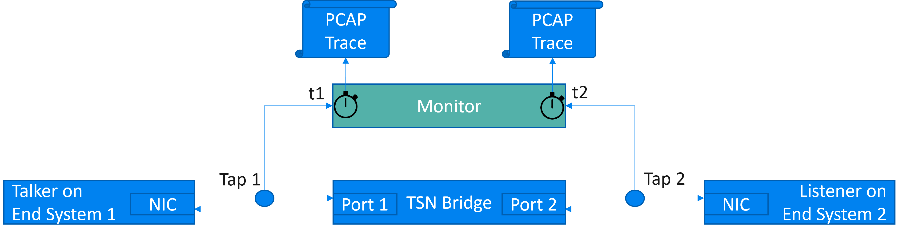
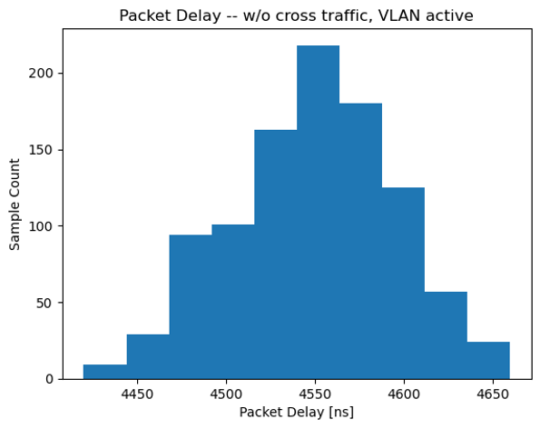

# PD-Wired

The data set in this repository provides delay measurements for an industrial TSN bridge.

## Acknowledgments

The data set in this repository is provided by University of Stuttgart as part of the DETERMINISTIC6G project, which has received funding from the European Union's Horizon Europe research and innovation programme under grant agreement No. 101096504.

[DETERMINISTIC6G Project Website](https://deterministic6g.eu/).

DETERMINISTIC6G e-mail: coordinator@deterministic6g.eu

## License

The data set is licensed under the [CC BY-SA 4.0 license](../LICENSE-CC-BY-SA.md).

If you use this data set in your published work, please cite the following paper:

G. P. Sharma, D. Patel, J. Sachs, M. De Andrade, J. Farkas, J. Harmatos, B. Varga, H. -P., Bernhard, R. Muzaffar, M. Ahmed, F. Dürr, D. Bruckner, E.M. De Oca, D. Houatra, H. Zhang and J. Gross: Toward Deterministic Communications in 6G Networks: State of the Art, Open Challenges and the Way Forward. IEEE Access, vol. 11, pp. 106898-106923, 2023, doi: 10.1109/ACCESS.2023.3316605

## Description of the measured data

Delays were measured with a commercial TSN bridge. The following figure shows the hardware setup of the measurements:



The talker and listener are connected to the TSN bridge through fibre cables with 1 Gbps. Taps are installed on these cables to mirror the signal (packets) to two ports of a network monitoring device (Napatech NT40E3-4-PTP SmartNIC). These taps are passive devices, not adding extra delay. The monitoring device produces two trace files in Packet Capture (PCAP) format: one for the ingress traffic to the TSN bridge; one for the egress traffic from the TSN bridge. All captured packets are timestamped with nanosecond resolution, using the same hardware clock for both monitoring ports.

The bridge operates in store&forward mode. All gates of the TSN bridge are always open, i.e., no TSN shaping is performed. TSN shaping is used to control queuing delay and depends on the configuration of the gate states in the GCL. Here, we are only interested in the PD without queuing delay (i.e., only transmission, processing, and propagation delay, which are not controllable by the IEEE 802.1Qbv schedule), and open gates ensure that incoming packets are forwarded immediately. Therefore, besides the packets being measured, any other traffic is minimized (only control packets from the Address Resolution Protocol (ARP) and the Rapid Spanning Tree Protocol (RSTP) are sent by the bridge). VLAN filtering is turned on, as this is common in TSN networks since the tag is also required to carry the PCP header field for defining the priority of packets. Here, all packets have the same priority since TSN scheduling is not active.

A total number of 1000 minimum-sized (64B) measurement packets are sent with a rate of 10 Pkt/s, i.e., with a deliberately low rate such that no congestion is building up in the egress port queue.

The following figure shows the histogram of the packet delay between Tap 1 and Tap 2. The minimum delay is 4420 ns; the maximum delay is 4660 ns; the mean is with 95 % confidence in the interval [4545 ns, 4550 ns].



Further information can be found in the publicly available report of Deliverable D4.1, available from the website of the [DETERMINISTIC6G Project](https://deterministic6g.eu/)

## Data format
This repository contains the raw measurement in the [raw](raw) folder.

The [main.py](main.py) script processes the raw data and converts it to a Histogram which can be user by the OMNeT++ simulation framework.

Each file describes a histogram of delay values, provided in XML format. An example histogram is shown next:

```xml
<histogram>
    <bin low="1ms">1</bin>
    <bin low="2ms">4</bin>
    <bin low="3ms">3</bin>
    <bin low="4ms">0</bin>
</histogram>
```

Each bin element covers a time interval ranging from value low to the low value of the next bin element and defines its value count as content of the element. The last element is only needed to define the upper bound of the last (previous) bin, and therefore, its count is always zero.
