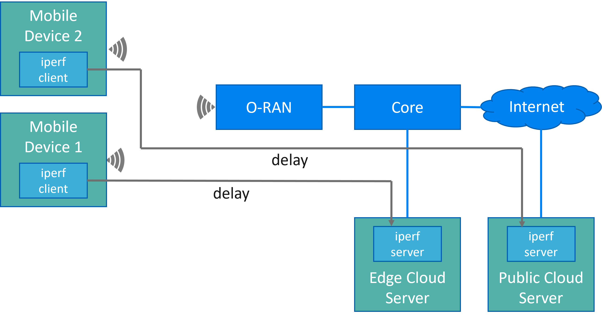

# ProcessingDelayDistribution1

The data set in this repository provides delay measurements of a smaller private edge cloud infrastructure.

## Acknowledgments

The data set in this repository is provided by Cumucore as part of the DETERMINISTIC6G project, which has received funding from the European Union's Horizon Europe research and innovation programme under grant agreement No. 101096504.

[DETERMINISTIC6G Project Website](https://deterministic6g.eu/).

DETERMINISTIC6G e-mail: coordinator@deterministic6g.eu

## License

The data set is licensed under the [CC BY-ND 4.0 license](../LICENSE-CC-BY-ND.md).

If you use this data set in your published work, please cite the repository as follows: 

Cumucore: Edge Cloud Delay Measurements. Zenodo. DOI: <will be assigned when uploaded to Zenodo>

## Description of the measured data

The following figure shows the setup and how delay was measured:



The environment for this edge cloud data set consists of one edge cloud server in a private edge cloud infrastructure. This edge cloud server is connected to one O-RAN indoor base station connected to a 5G core. The core is also connected to the public Internet where another public cloud server is operating. 

Two mobile devices (smart phones) are communicating through the base station with the private edge cloud server and the public cloud server, respectively.
The ping tool was used to measure the round-trip delays. All devices have synchronized clocks.
Further information can be found in the publicly available report of Deliverable D4.1, available from the website of the [DETERMINISTIC6G Project](https://deterministic6g.eu/)

## Data format
This repository contains the raw measurement in the [mmWave_delay](raw/mmWave_delay) and [ORAN_MEC](raw/ORAN_MEC) folders.

The [main.py](main.py) script processes the raw data and converts it to a Histogram which can be used by the [DetCom simulator framework](https://github.com/DETERMINISTIC6G/deterministic6g).

Each file describes a histogram of delay values, provided in XML format. An example histogram is shown next:

```xml
<histogram>
    <bin low="1ms">1</bin>
    <bin low="2ms">4</bin>
    <bin low="3ms">3</bin>
    <bin low="4ms">0</bin>
</histogram>
```

Each bin element covers a time interval ranging from value low to the low value of the next bin element and defines its value count as content of the element. The last element is only needed to define the upper bound of the last (previous) bin, and therefore, its count is always zero.
